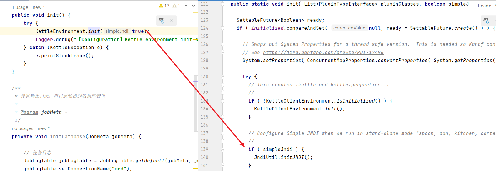
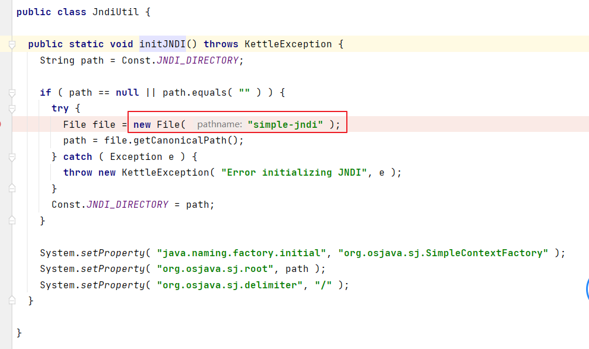

[TOC]

# 参考
## 执行作业、转换的demo
借鉴[Java调用Kettle](https://www.cnblogs.com/chenss15060100790/p/16789378.html)所列举出的依赖
然后去到[github pentaho-kettle源码的ui模块](https://github.com/pentaho/pentaho-kettle/blob/master/ui/pom.xml)复制对应依赖
```xml
<?xml version="1.0" encoding="UTF-8"?>
<project xmlns="http://maven.apache.org/POM/4.0.0"
         xmlns:xsi="http://www.w3.org/2001/XMLSchema-instance"
         xsi:schemaLocation="http://maven.apache.org/POM/4.0.0 http://maven.apache.org/xsd/maven-4.0.0.xsd">
    <modelVersion>4.0.0</modelVersion>

    <groupId>com.hjp</groupId>
    <artifactId>kettle-api</artifactId>
    <version>1.0-SNAPSHOT</version>

    <properties>
        <maven.compiler.source>20</maven.compiler.source>
        <maven.compiler.target>20</maven.compiler.target>
        <project.build.sourceEncoding>UTF-8</project.build.sourceEncoding>

        <project-version>9.5.0.0-SNAPSHOT</project-version>

    </properties>

    <dependencies>
        <!-- Kettle dependencies -->
        <dependency>
            <groupId>pentaho-kettle</groupId>
            <artifactId>kettle-core</artifactId>
            <version>${project-version}</version>
        </dependency>
        <dependency>
            <groupId>pentaho-kettle</groupId>
            <artifactId>kettle-engine</artifactId>
            <version>${project-version}</version>
        </dependency>
        <dependency>
            <groupId>pentaho-kettle</groupId>
            <artifactId>kettle-dbdialog</artifactId>
            <version>${project-version}</version>
        </dependency>

        <!-- Pentaho dependencies -->
        <dependency>
            <groupId>pentaho</groupId>
            <artifactId>pentaho-vfs-browser</artifactId>
            <version>${project-version}</version>
        </dependency>

        <!-- Test dependencies -->
        <dependency>
            <groupId>pentaho-kettle</groupId>
            <artifactId>kettle-engine</artifactId>
            <version>${project-version}</version>
            <classifier>tests</classifier>
            <scope>test</scope>
        </dependency>
        <dependency>
            <groupId>pentaho-kettle</groupId>
            <artifactId>kettle-core</artifactId>
            <version>${project-version}</version>
            <classifier>tests</classifier>
            <scope>test</scope>
        </dependency>
        <dependency>
            <groupId>org.mockito</groupId>
            <artifactId>mockito-all</artifactId>
            <version>1.10.19</version>
            <scope>test</scope>
        </dependency>
        <dependency>
            <groupId>org.powermock</groupId>
            <artifactId>powermock-module-junit4</artifactId>
            <version>1.7.3</version>
            <scope>test</scope>
        </dependency>
        <dependency>
            <groupId>org.powermock</groupId>
            <artifactId>powermock-api-mockito</artifactId>
            <version>1.7.3</version>
            <scope>test</scope>
        </dependency>
        <dependency>
            <groupId>org.syslog4j</groupId>
            <artifactId>syslog4j</artifactId>
            <version>0.9.34</version>
        </dependency>
    </dependencies>

    <repositories>
        <repository>
            <id>pentaho-public</id>
            <name>Pentaho Public</name>
            <url>https://repo.orl.eng.hitachivantara.com/artifactory/pnt-mvn/</url>
            <releases>
                <enabled>true</enabled>
                <updatePolicy>daily</updatePolicy>
            </releases>
            <snapshots>
                <enabled>true</enabled>
                <updatePolicy>interval:15</updatePolicy>
            </snapshots>
        </repository>
    </repositories>

    <pluginRepositories>
        <pluginRepository>
            <id>pentaho-public-plugins</id>
            <name>Pentaho Public Plugins</name>
            <url>https://repo.orl.eng.hitachivantara.com/artifactory/pnt-mvn/</url>
            <snapshots>
                <enabled>false</enabled>
            </snapshots>
            <releases>
                <updatePolicy>never</updatePolicy>
            </releases>
        </pluginRepository>
    </pluginRepositories>
</project>
```
### 执行simple-jndi方式连接数据库的转换
参考[java项目中使用kettle的JNDI连接配置](https://www.cnblogs.com/liyunzhouts/p/8084722.html)
1. 需要复制[simple-jndi文件夹](simple-jndi)到项目根目录下
2. 打开初始化代码中的`simple-jndi`开关


